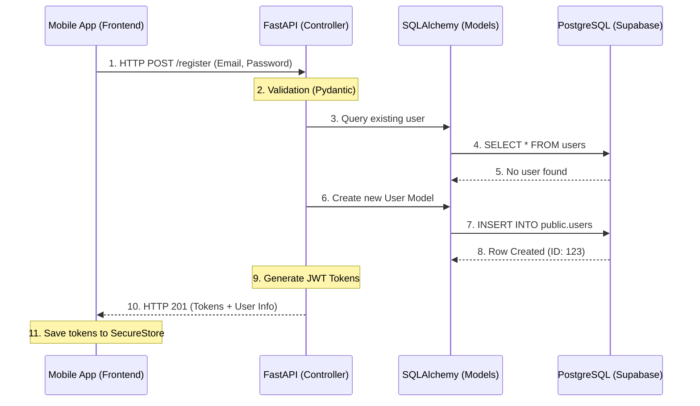

# System Architecture: Auth Data Flow

This document explains exactly how data moves through your system during Login or Sign Up, from the moment a user taps a button to the moment the record is secured in the database.

## 1. The High-Level Flow (Mermaid)

## 2. Layer-by-Layer Breakdown

### Phase A: The Frontend (The "Messenger")
- **File**: `src/services/auth.service.ts`
- **What happens**: The app takes your input, wraps it in a JSON object, and hands it to the **Axios** client (`api.ts`). Axios prepends the `API_BASE_URL` (the IP address we recently fixed) and shoots the request over your network.
- **Developer Analogy**: It's like filling out a form and mailing it to an address. If the address is wrong (wrong IP), the letter never arrives (Timeout).

### Phase B: The Controller (The "Gatekeeper")
- **File**: `backend/app/api/v1/endpoints/auth.py`
- **What happens**: FastAPI receives the "mail". It immediately checks if the data matches the rules (Pydantic Schema): "is the email valid?", "is the password long enough?".
- **Logic**: It reaches out to the database session to see if you're already registered. If everything is clear, it hashes your password (security!) and prepares to save.

### Phase C: The Model (The "Architect")
- **File**: `backend/app/db/models.py`
- **What happens**: This is where the database structure is defined. The Controller creates a new instance of the `User` class. 
- **DB Session**: The session (`AsyncSession`) handles the conversation with PostgreSQL. When we call `await db.commit()`, the Model is translated into a SQL `INSERT` command.

### Phase D: The Database (The "Vault")
- **Platform**: Supabase (PostgreSQL)
- **What happens**: PostgreSQL receives the SQL. Before it saves, it checks the **RLS Policies** we just added. 
- **Security Check**: "Is this service_role authorized to insert this user?" ➔ **YES**. The data is safely written to the disk.

## 3. Why it might still fail (Checklist)

1.  **Network Isolation**: If your computer is on a "Public" or "Guest" WiFi, the mobile phone might be blocked from talking to the computer, even if the IP is correct.
2.  **Windows Firewall**: Windows often blocks port `8000` by default. You may need to create an "Inbound Rule" to allow traffic on that port.
3.  **Expo Config Cache**: Sometimes Expo doesn't update the `devApiUrl` immediately. 
    - **Fix**: Run `npx expo start -c` to clear the cache.

---
**Status**: Architecture Documented | **Current Focus**: Connectivity Debugging
